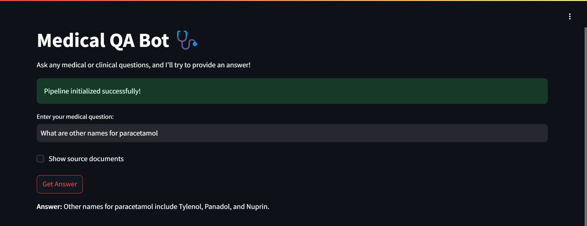

# **Medical Retrieval-Augmented Question Answering (RAG) System**

This project implements a **Retrieval-Augmented Generation (RAG)** system tailored for answering medical and clinical queries. It leverages advanced retrieval and natural language generation technologies to provide accurate and reliable answers supported by contextually relevant source documents.

---

## **Key Features**
- **Knowledge Retrieval**: Efficiently retrieves relevant medical information from a knowledge base using Pinecone.
- **Natural Language Understanding**: Processes and generates human-like responses using state-of-the-art language models (LLaMA 1B and 3B).
- **Explainability**: Returns source documents alongside answers for improved transparency and validation.
- **Scalable Architecture**: Built on robust components like Pinecone and LangChain to handle large knowledge bases.

---

## **Technologies Used**

### 1. **LangChain**
- Framework for building language model-powered applications.
- Manages the `RetrievalQA` chain to combine document retrieval with natural language answer generation.

### 2. **Pinecone**
- Vector database for storing and retrieving document embeddings.
- Facilitates fast and accurate retrieval of relevant documents for the query.

### 3. **LLaMA Models**
- **LLaMA 1B**: Efficient for smaller-scale tasks with faster inference.
- **LLaMA 3B**: Provides richer, more accurate responses for complex queries.
- Models are hosted using HuggingFace's Hub.

### 4. **RetrievalQA Chain**
- Integrates retrieval (Pinecone) and language generation (LLaMA models).
- Ensures that answers are contextually accurate and traceable to source documents.

---

## **Setup and Installation**

Follow these steps to set up the project locally:

### **1. Clone the Repository**
```bash
git clone https://github.com/youssef-223/Medical-RAG-QA.git
cd Medical-RAG-QA
```

### **2. Install Dependencies***
Ensure you have Python 3.9+ installed. Install required libraries using:
```bash
pip install -r requirements.txt
```

### **3. Configure Pinecone**

- Sign up at [Pinecone](https://www.pinecone.io/).
- Create an index and note your **API Key** and **Environment**.
- Update the Pinecone configuration in the code:

```python
pinecone.init(api_key="YOUR_API_KEY", environment="YOUR_ENVIRONMENT")
```

## **4. Usage**

### **Running the Application**

1. Start the application:

```bash
streamlit run app.py
```

2. Open the provided URL in your browser to interact with the interface.

### **4. Querying the System**

- Enter a medical or clinical question into the input box.
- Example query: _"What are the symptoms of cholera?"_
- Click the **"Get Answer"** button to receive the response.




