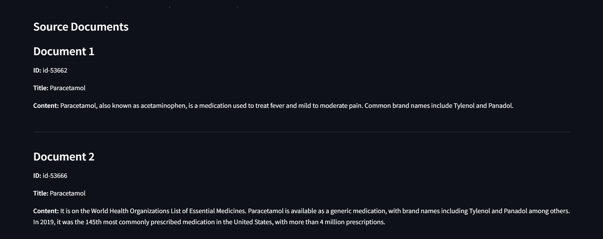

# **Medical Retrieval-Augmented Question Answering (RAG) System**

This project implements a **Retrieval-Augmented Generation (RAG)** system tailored for answering medical and clinical queries. It leverages advanced retrieval and natural language generation technologies to provide accurate and reliable answers supported by contextually relevant source documents.


## **Key Features**
- **Knowledge Retrieval**: Efficiently retrieves relevant medical information from a knowledge base using Pinecone.
- **Natural Language Understanding**: Processes and generates human-like responses using state-of-the-art language models (LLaMA 1B and 3B).
- **Explainability**: Returns source documents alongside answers for improved transparency and validation.
- **Scalable Architecture**: Built on robust components like Pinecone and LangChain to handle large knowledge bases.


## **Technologies Used**

### 1. **LangChain**
- Framework for building language model-powered applications.
- Manages the `RetrievalQA` chain to combine document retrieval with natural language answer generation.

### 2. **Pinecone**
- Vector database for storing and retrieving document embeddings.
- Facilitates fast and accurate retrieval of relevant documents for the query.

### 3. **LLaMA Models**
- **LLaMA 1B**: Efficient for smaller-scale tasks with faster inference.
- **LLaMA 3B**: Provides richer, more accurate responses for complex queries.
- Models are hosted using HuggingFace's Hub.

### 4. **RetrievalQA Chain**
- Integrates retrieval (Pinecone) and language generation (LLaMA models).
- Ensures that answers are contextually accurate and traceable to source documents.


## **Setup and Installation**

Follow these steps to set up the project locally:

### **1. Clone the Repository**
```bash
git clone https://github.com/youssef-223/Medical-RAG-QA.git
cd Medical-RAG-QA
```

### **2. Install Dependencies***
Ensure you have Python 3.9+ installed. Install required libraries using:
```bash
pip install -r requirements.txt
```

### **3. Configure Pinecone and Huggingface**

- Sign up at [Pinecone](https://www.pinecone.io/).
- Create an index and note your **API Key**.
- Update the Pinecone configuration in the `.env` file:

```python
PINECONE_API_KEY=''
HF_HUB_API_TOKEN=''
PINECONE_INDEX_NAME=''
```

## **4. Usage**

### **Running the Application**

1. Start the application:

```bash
streamlit run app.py
```

2. Open the provided URL in your browser to interact with the interface.

### **Querying the System**

- Enter a medical or clinical question into the input box.
- Example query: _"What are the symptoms of cholera?"_
- Click the **"Get Answer"** button to receive the response.

### **Answer Display**
- The system provides:
   - A concise and helpful answer.
   - Relevant source documents for reference.





## Architecture

1. **Query Input**: Users provide a query through the Streamlit interface.
2. **Document Retrieval**:
    - The query is transformed into an embedding.
    - Pinecone searches the vector database for the most relevant documents.
3. **Answer Generation**:
    - Relevant documents are passed to the Llama-1B/3B model via LangChain.
    - The model generates an answer based on the retrieved documents.
4. **Response**: The answer is displayed to the user on the Streamlit interface.


## Code Walkthrough

### Pipeline Initialization

```python
qa_pipeline = RetrievalQA.from_chain_type(
    llm=hf_llm,
    retriever=retriever,
    return_source_documents=True
)
```

### Answer Extraction
Regular expressions are used to parse the helpful answer from the model's response:
```python
match = re.search(r"Helpful Answer:\s*(.*)", result['result'])
helpful_answer = match.group(1).strip()
```

### Source Documents Display
- Documents are presented with metadata:
```python
for i, doc in enumerate(source_docs, start=1):
    st.markdown(f"### Document {i}")
    st.markdown(f"**ID:** {doc['id']}")
    st.markdown(f"**Title:** {doc['metadata']['title']}")
    st.markdown(f"**Content:**\n{doc['page_content']}")
```
---
### Future Improvements
- Enhanced Models:
   - Experiment with larger models like LLaMA-13B for improved accuracy.
- Knowledge Base Expansion:
   - Include more clinical datasets for broader coverage.
- Fine-Tuning:
   - Fine-tune LLaMA models for specific medical contexts.
- User Feedback:
   - Add a feature to collect user feedback for continuous improvement.


## Contributing

Contributions are welcome! To contribute:

1. Fork the repository.
2. Create a feature branch:
   ```bash
   git checkout -b feature-name
   ```
3. Commit your changes and push:
   ```bash
    git push origin feature-name
   ```
4. Create a pull request.


---

### License
This project is licensed under the MIT License. See the LICENSE file for details.

---

### Contact
For any questions or support, feel free to reach out:

GitHub Issues:[Open an issue](https://github.com/youssef-223/Medical-RAG-QA/issues)